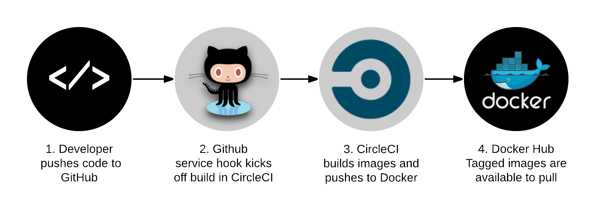

SSL site scanner
================

&nbsp;
&nbsp;
&nbsp;

Source code:    https://github.com/jumanjihouse/docker-ssllabs-scan/ 
Docker image:   https://registry.hub.docker.com/u/jumanjiman/ssllabs-scan/ 
Image metadata: http://microbadger.com/images/jumanjiman/ssllabs-scan/

:warning: You must use version 1.4.0 or later of this image
for compatibility with the Qualys SSL Labs Service API.

About
-----

This git repo downloads golang source code from
https://github.com/ssllabs/ssllabs-scan
and builds a tiny docker image that scans secure websites
with the Qualys SSL Labs service.

The build takes about 30 seconds and results in a 5 MiB Docker image.
 The runtime image contains **only**:

* a static binary,
* CA certificates, and
* `/etc/passwd` to provide an unprivileged user.

The container runs as an unprivileged user via the technique described in
[this Medium post](https://medium.com/@lizrice/non-privileged-containers-based-on-the-scratch-image-a80105d6d341).

Before you use this tool please review the terms and conditions,
which can be found here:
https://www.ssllabs.com/about/terms.html

### Build integrity

The repo is set up to compile the software in a "builder" container, then
copy the statically-compiled binary into a "runtime" container
free of development tools or other binaries that could be abused.
An unattended test harness runs the build script and runs acceptance tests.
If all tests pass on master branch in the unattended test harness,
it pushes the built images to the Docker hub.

License
-------

See [LICENSE.md](https://github.com/jumanjiman/docker-ssllabs-scan/blob/master/LICENSE.md)
in this git repo.

How-to
------

### Build and test

:warning: Build requires Docker CE 17.06.1 (for multi-stage builds) or later
as well as docker-compose.

    ci/build
    ci/test

### Pull an already-built image

For user convenience, each published image is tagged with
`<upstream-version-number>-<date>T<time>-git-<git-short-hash>` to correlate
with both the upstream software release and the git commit
of this repo. The "latest" tag always points to the most
recent build.

    docker pull jumanjiman/ssllabs-scan:latest

### View image labels

Each built image has labels that generally follow http://label-schema.org/

We add a label, `ci-build-url`, that is not currently part of the schema.
This extra label provides a permanent link to the CI build for the image.

View the ci-build-url label on a built image:

    docker inspect \
      -f '{{ index .Config.Labels "io.github.jumanjiman.ci-build-url" }}' \
      jumanjiman/ssllabs-scan

Query all the labels inside a built image:

    docker inspect jumanjiman/ssllabs-scan | jq -M '.[].Config.Labels'

### Run

The following example uses `--read-only` and `--cap-drop all` as recommended by the
CIS Docker Security Benchmarks:

* [Docker 1.6](https://benchmarks.cisecurity.org/tools2/docker/CIS_Docker_1.6_Benchmark_v1.0.0.pdf)
* [Docker 1.11](https://benchmarks.cisecurity.org/tools2/docker/CIS_Docker_1.11.0_Benchmark_v1.0.0.pdf)
* [Docker 1.12](https://benchmarks.cisecurity.org/tools2/docker/CIS_Docker_1.12.0_Benchmark_v1.0.0.pdf)
* [Docker 1.13](https://benchmarks.cisecurity.org/tools2/docker/CIS_Docker_1.13.0_Benchmark_v1.0.0.pdf)

Example:

    $ docker_opts="--read-only --cap-drop all --rm -it"
    $ image="jumanjiman/ssllabs-scan:latest"
    $ scan_opts="-grade -usecache"
    $ url_to_scan="https://github.com/"
    $ docker run ${docker_opts} ${image} ${scan_opts} ${url_to_scan}
    2015/06/14 23:01:01 [INFO] SSL Labs v1.18.1 (criteria version 2009j)
    2015/06/14 23:01:01 [NOTICE] Server message: This assessment service is provided free of charge by Qualys SSL Labs, subject to our terms and conditions: https://www.ssllabs.com/about/terms.html
    2015/06/14 23:01:03 [INFO] Assessment starting: https://github.com
    2015/06/14 23:01:04 [INFO] Assessment complete: https://github.com (1 host in 96 seconds)
        192.30.252.129: A+
    "https://github.com": "A+"

    2015/06/14 23:01:04 [INFO] All assessments complete; shutting down

You can also use the `-hostfile` option if you inject a local
file into the container:

    # Create a hostfile in local filesystem.
    $ ls -la /tmp/sites.txt
    -rw-r--r--    1 user     user            48 Mar 12 15:39 /tmp/sites.txt

    # Use docker `-v` option to inject a file into the container to use -hostfile option.
    $ docker run -v /tmp:/tmp:ro ${docker_opts} ${image} -hostfile /tmp/sites.txt ${scan_opts}
    2016/03/12 15:45:01 [INFO] SSL Labs v1.22.37 (criteria version 2009l)
    2016/03/12 15:45:01 [NOTICE] Server message: This assessment service is provided free of charge by Qualys SSL Labs, subject to our terms and conditions: https://www.ssllabs.com/about/terms.html
    2016/03/12 15:45:03 [INFO] Assessment starting: https://www.github.com/
    2016/03/12 15:45:04 [INFO] Assessment starting: https://www.google.com/
    2016/03/12 15:45:04 [INFO] Assessment complete: https://www.github.com/ (1 host in 83 seconds)
        192.30.252.129: A
    2016/03/12 15:45:05 [INFO] Assessment complete: https://www.google.com/ (2 hosts in 109 seconds)
        2607:f8b0:4005:802:0:0:0:2004: B
        172.217.2.36: B
    "https://www.github.com/": "A"
    "https://www.google.com/": "B"

    2016/03/12 15:45:05 [INFO] All assessments complete; shutting down

You can use `docker-compose` with the `docker-compose.yaml` file in this git repo:

    $ docker-compose run --rm scanner -grade -usecache https://github.com
    2017/05/13 15:35:37 [INFO] SSL Labs v1.28.5 (criteria version 2009o)
    2017/05/13 15:35:37 [NOTICE] Server message: This assessment service is provided free of charge by Qualys SSL Labs, subject to our terms and conditions: https://www.ssllabs.com/about/terms.html
    2017/05/13 15:35:39 [INFO] Assessment starting: https://github.com
    2017/05/13 15:35:40 [INFO] Assessment complete: https://github.com (2 hosts in 108 seconds)
        192.30.255.112: A+
        192.30.255.113: A+
    "https://github.com": "A+"

    2017/05/13 15:35:40 [INFO] All assessments complete; shutting down
